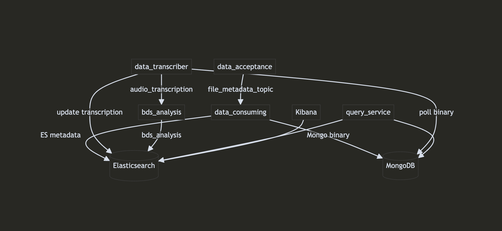

# The Muezzin - Audio Processing Pipeline

[](https://www.python.org/downloads/release/python-3110/)
[](LICENSE)

End-to-end audio pipeline: ingest WAV → Kafka → MongoDB (binary) + Elasticsearch (metadata + transcription) → BDS analysis → query API.

## Contents
- Overview
- Diagram
- Why this design
- Architecture (services & infra)
- How to run
- Query API
- Troubleshooting

## Overview
The system ingests WAV files, extracts metadata, persists audio bytes in MongoDB, indexes searchable fields in Elasticsearch, transcribes audio to text, analyzes the text for BDS signals, and exposes a small HTTP API for safe querying without exposing DB credentials.

## Diagram


## Why this design
- Microservices keep each responsibility small and independently debuggable/scalable.
- Kafka decouples producers/consumers and tolerates bursts and restarts.
- Dual storage plays to strengths: MongoDB for raw binary, Elasticsearch for search.
- Centralized logging makes cross-service traceability simple.
- Ingestion modes: single-file (fast iteration, targeted debugging) and batch (scale, backfill). We keep both to support development velocity and realistic throughput; `scripts/commands.sh` uses batch by default.
- BDS thresholds are configurable to balance sensitivity vs. specificity and are justified in code comments for transparency.

### Libraries rationale 
- TinyTag: lightweight audio metadata extraction without heavy media deps.
- pydub: simple audio manipulation to normalize inputs for STT.
- SpeechRecognition: vendor-agnostic speech-to-text wrapper; easy to swap engines.

## Architecture
- Services
  - data_acceptance: reads local WAVs, publishes metadata (and path) to Kafka `file_metadata_topic`.
  - data_consuming: consumes metadata, indexes to Elasticsearch, stores binary to MongoDB.
  - data_transcriber: pulls audio from MongoDB, transcribes, updates Elasticsearch, and publishes transcription to Kafka `audio_transcription`.
  - bds_analysis: consumes transcriptions, computes BDS metrics, indexes results to Elasticsearch `bds_analysis`.
  - query_service: FastAPI gateway for read-only queries to ES/Mongo; no DB creds exposed to users.
- Infrastructure
  - Kafka + Zookeeper, Elasticsearch (+ optional Kibana), MongoDB.

## Repo structure (high‑level)
```
TheMuezzin/
├── scripts/            # One-command startup script(s)
├── services/
│   ├── data_acceptance/    # Producer: WAV → Kafka (metadata + path)
│   ├── data_consuming/     # Consumer: Kafka → ES (metadata) + Mongo (binary)
│   ├── data_transcriber/   # Worker: Mongo → STT → ES + Kafka (transcription)
│   ├── bds_analysis/       # Consumer: transcription → BDS → ES
│   └── query_service/      # FastAPI: safe read-only access to ES/Mongo
├── shared/             # Common utilities (logger, analyzers, config)
├── README.md           # This file
├── docker-compose.yml  # Optional full-stack orchestration (for reference)
└── diagram.png         # Architecture diagram used in README
```

## How to run
Use the one-command script which starts infra, services, the query API, and performs batch ingestion: `bash scripts/commands.sh`.

Notes
- Local defaults target `localhost` for Kafka/ES/Mongo.
- The batch processor reads WAVs from `/Users/mordechaywolff/Desktop/podcasts` (adjust via env if needed).

## Query API
Purpose: safe, read-only access for consumers.
- Health: `http://localhost:8080/health`
- Files search: `http://localhost:8080/search/files?q=<term>`
- Transcriptions search: `http://localhost:8080/search/transcriptions?q=<term>`
- Recent files: `http://localhost:8080/files/recent?size=10`
- BDS filter: `http://localhost:8080/bds/search?min_percentage=15&threat_level=low`
- Swagger UI: `http://localhost:8080/docs`

## Troubleshooting
- Kafka from host must advertise `PLAINTEXT://localhost:9092`.
- Elasticsearch may log connection errors during startup; the script waits for health.
- Quote URLs with `?` in shells when testing (e.g., `"http://.../search/files?q=term"`).

–– For deeper details (env vars, thresholds, implementation), see the code under `services/*` and comments in `scripts/commands.sh`.
